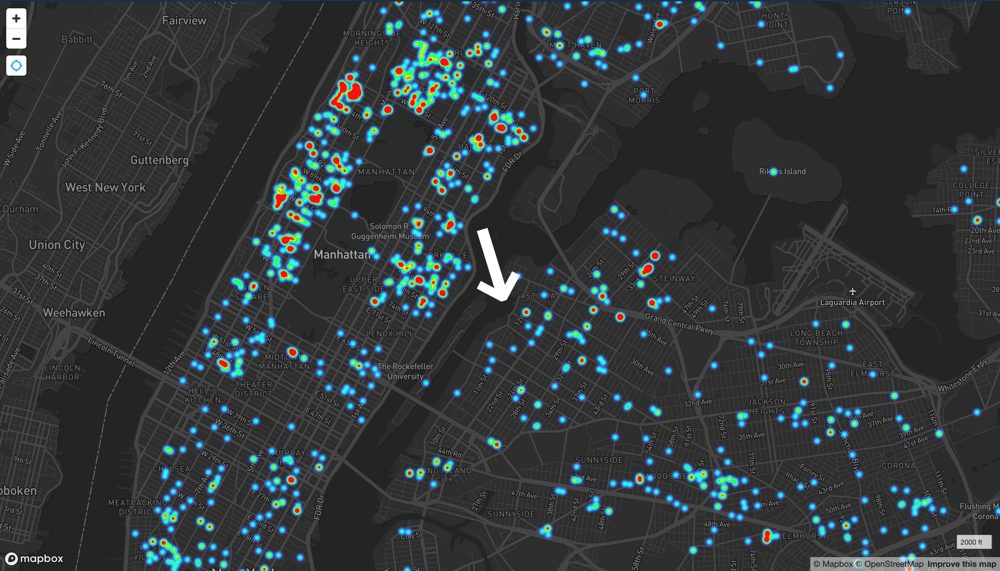

# Heatmap of Rats in NYC
 <strong> ------- Description: ------- </strong>  Created a tileset using external data (rat sightings in NYC) and produced a location-aware heatmap. 
 <strong> ------- What Does It Do? ------- </strong>   The map will center on the user's position and point to the nearest rat sighting, assuming there is one nearby. 
 <strong> ------- Try it Out! ------- </strong>   Try this out on your mobile device (or computer)! Click on the link above or click <a href="https://leesel.github.io/nyc_rats/" target="blank">here</a>. (Optional Tip: Open link in new tab)  
<strong> Preview: </strong>   

